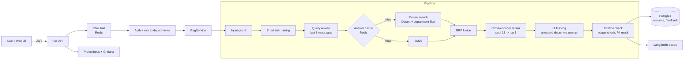
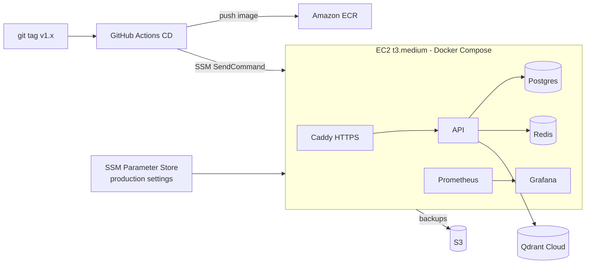

# Nexora Knowledge Assistant

**A production-style RAG system that answers employee questions from company PDFs, with citations, and only from the documents that person's role is allowed to see.**


> **Live demo:** `https://<YOUR-DOMAIN>/` (deployed on AWS EC2) &nbsp;|&nbsp; **3-min video:** `<LOOM-OR-YOUTUBE-LINK>` &nbsp;|&nbsp; **API docs:** `https://<YOUR-DOMAIN>/docs`

<!-- Replace with your recorded GIF: docs/images/demo.gif (see docs/portfolio/demo-video-script.md) -->


---

## The problem

Employees waste time searching HR, Engineering, Finance and Product PDFs. A plain chatbot is not acceptable here, because:

1. It must **cite its sources**, so answers can be checked.
2. It must **never leak** a document across roles (an employee must not read Finance files).
3. It must be **measured**: "it seems good" is not a metric.

Nexora answers in about 4 to 5 seconds, cites the page it used, and was evaluated on a hand-written 30-question golden set.

## Results (measured, not estimated)

All numbers: 30-question golden set, final run `final_k3` (top_k = 3, `openai/gpt-oss-120b`). Source: [`docs/eval/report.md`](docs/eval/report.md).

**Retrieval: baseline vs final**

| Retriever | hit@3 | MRR | recall@3 |
|---|---|---|---|
| Dense only (baseline) | 0.900 | 0.794 | 0.850 |
| Hybrid (BM25 + RRF) | 0.933 | 0.850 | 0.867 |
| **Hybrid + cross-encoder rerank (final)** | **1.000** | **0.889** | **0.950** |

**Generation (DeepEval, self-hosted Ollama judge)**

| Metric | Score |
|---|---|
| Faithfulness | 0.989 |
| Answer relevancy | 0.933 |
| Contextual precision | 0.928 |
| Contextual recall | 0.967 |
| Contextual relevancy | 0.121 (weak, see [Limitations](#limitations)) |

**Latency, found by measuring each stage first** ([`docs/latency_results.md`](docs/latency_results.md))

| Change | Effect |
|---|---|
| Stage breakdown | Reranking was 78% of the time (7.38 s average) |
| Rerank candidate pool 30 -> 15 | Rerank 7.38 s -> 2.79 s, retrieval metrics unchanged |
| LLM context 5 -> 3 chunks | Smaller prompt (9-11K -> 5.4-7K chars), hit@3 still 1.0 |
| Redis exact-match answer cache | Repeat questions answered in about 0 s |

Honest note: the 21 s baseline was measured while the Groq free tier was throttling, so part of it was rate-limit waiting. The pipeline itself needs about 4 to 5 s per question.

**Tests:** 230 tests, 84.58% coverage (CI gate 80%), lint and mypy in CI, red-team suite with data-driven attacks.

## Architecture



**Deployment (AWS)**



Deploys use SSM, so port 22 stays closed. If the new version is not healthy, `deploy.sh` rolls back to the previous tag automatically. Details: [`docs/deployment.md`](docs/deployment.md).

## Key decisions

Short Architecture Decision Records in [`docs/adr/`](docs/adr/):

| ADR | Decision |
|---|---|
| [0001](docs/adr/0001-qdrant-vector-store.md) | Qdrant as the vector store |
| [0002](docs/adr/0002-hybrid-search-and-rerank.md) | Hybrid search (dense + BM25 + RRF) and a cross-encoder reranker |
| [0003](docs/adr/0003-chunking-strategy.md) | Chunk size and overlap |
| [0004](docs/adr/0004-rbac-inside-retrieval.md) | RBAC filter inside the search and inside the cache key |
| [0005](docs/adr/0005-langsmith-observability.md) | LangSmith for tracing |
| [0006](docs/adr/0006-single-ec2-deployment.md) | One EC2 VM with Docker Compose, deployed through SSM |

Also: [`MODEL_CARD.md`](MODEL_CARD.md) (models, data, risks) and [`docs/technical-reference.md`](docs/technical-reference.md) (the full step-by-step technical write-up).

## Quick start (local, about 10 minutes)

Requirements: Python 3.12, Docker, a free [Qdrant Cloud](https://cloud.qdrant.io) cluster and a free [Groq](https://console.groq.com) API key.

```bash
git clone https://github.com/abubakarsaddique22/production_level_rag_project.git
cd production_level_rag_project

python -m venv .venv
source .venv/bin/activate            # Windows: .venv\Scripts\Activate.ps1
pip install -r requirements-dev.txt    # runtime + PDF ingestion + test/eval tools (requirements.txt = runtime only)

cat > .env <<'EOF'
RAG_QDRANT_URL=https://<cluster-id>.<region>.cloud.qdrant.io:6333
RAG_QDRANT_API_KEY=<your-key>
RAG_GROQ_API_KEY=<your-key>
RAG_GROQ_MODEL=openai/gpt-oss-120b
RAG_JWT_SECRET=<any-long-random-string>
EOF

docker compose up -d redis postgres        # local Redis + Postgres
python scripts/create_tables.py            # or: alembic upgrade head
python scripts/seed_users.py               # 5 test users, one per role
export PYTHONPATH=src                       # Windows PowerShell: $env:PYTHONPATH = "src"
python -m nexora_rag.ingestion.pipeline    # parse -> clean -> chunk -> embed the 10 PDFs in data/raw
python -m nexora_rag.retrieval.vector_store  # upload the vectors to Qdrant (safe to re-run)
uvicorn nexora_rag.api.main:app --reload
```

Open `http://localhost:8000/` (web UI) or `http://localhost:8000/docs` (Swagger).
Log in as `admin@nexora.test` / `Test@1234` (local test password only) and ask: *"How many calendar days do I have to submit an expense claim?"*

Try the access control: log in as `employee@nexora.test` and ask a Finance or Engineering question. The answer must not contain content from those departments.

Run the tests: `python -m pytest tests/unit tests/redteam -q` (integration tests: `python -m pytest tests/integration -q`, needs Redis and Postgres).

Reproduce the evaluation: `python scripts/run_eval.py` then `python scripts/make_report.py`.

## What I built

- **Retrieval:** dense + BM25 with Reciprocal Rank Fusion, cross-encoder rerank, department filter applied inside the vector search.
- **Generation:** `[n]` citations validated against retrieved chunks; answers without valid citations return no sources and are never cached.
- **Security:** JWT + RBAC, prompt hardening against injected documents, PII masking (Presidio plus Pakistani CNIC and phone recognizers), output leak checks, OWASP LLM Top 10 mapping.
- **Agent:** LangGraph agent (router, safe calculator, ticket lookup, groundedness check, bounded retries), compared honestly against plain RAG.
- **Ops:** Docker multi-stage image, GitHub Actions CI (lint, mypy, tests, Docker build) and CD to AWS, Prometheus/Grafana, LangSmith tracing with user feedback, S3 backups.

## Limitations

- **Contextual relevancy is 0.121.** Chunks are large (about 2,400 characters), so they contain a lot of text unrelated to the question. This is my suspected cause and it is **not verified yet**.
- **Small golden set.** 30 answerable questions: no unanswerable, adversarial or multi-document questions, so refusal accuracy is not measured.
- **The agent is not better than plain RAG** on this data (16/20 vs 16/20). Both fail all 4 multi-document questions.
- **Judge noise.** DeepEval scores moved about 0.02 to 0.03 between runs, so small differences are not real.
- **Known red-team gaps** (kept as `xfail` tests): paraphrased and Roman Urdu jailbreaks are not caught by the regex layer.
- **Latency was not re-measured** after adding PII masking, and not measured on the AWS deployment.
- **Single VM, no autoscaling.** One EC2 instance is a single point of failure.

## Future work

1. Chunk-size experiment (300 / 600 / 1000 tokens) with the existing retrieval metrics, to test the contextual relevancy hypothesis.
2. Larger golden set with unanswerable and multi-document questions, plus a refusal-accuracy metric.
3. Multi-hop retrieval (split the question first, or iterate retrieval) for the 4 failing questions.
4. Streaming responses (the Caddy config already does not buffer).
5. Semantic or LLM-based jailbreak detection to close the `xfail` gaps.
6. Load test on the deployed instance and publish p50/p95 for production.

## Repository map

```
src/nexora_rag/   api, core, db, ingestion, embeddings, retrieval, generation, guardrails, agents, evaluation, observability
frontend/         plain HTML/CSS/JS chat UI, served by the API at /
scripts/          seed_users, run_eval, make_report, check_regression, measure_latency, deploy.sh, backup.sh
tests/            unit, integration, redteam
docs/             adr/, eval/ (report + charts), deployment.md, technical-reference.md, portfolio/
infra/            Caddy, Prometheus, Grafana
.github/workflows ci.yml, cd.yml
```
