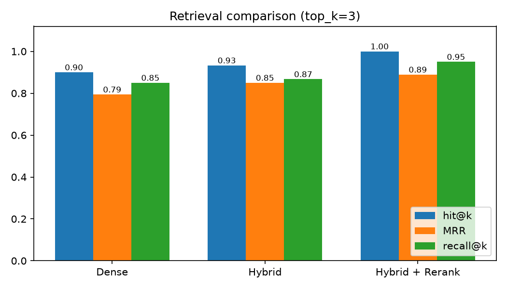
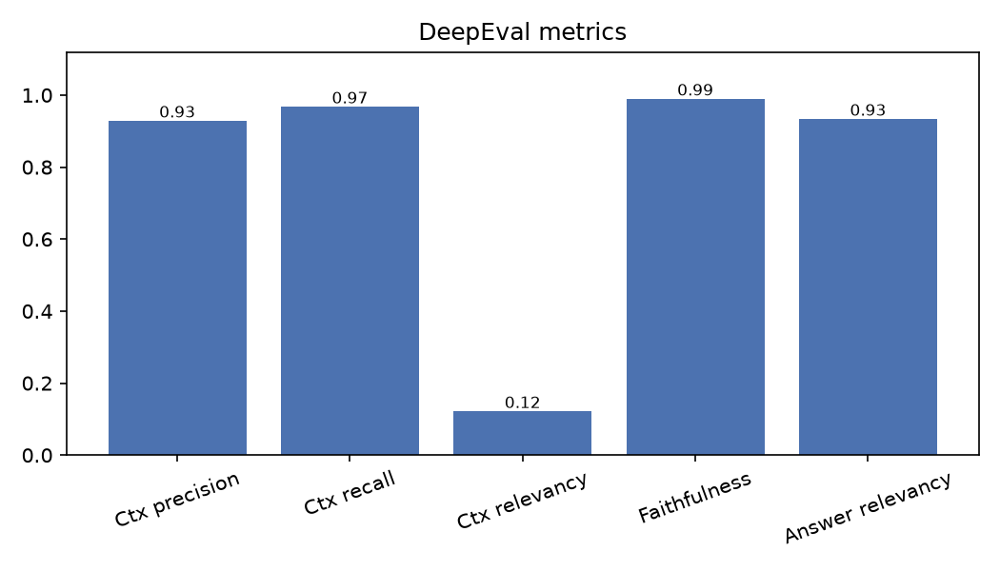

# Evaluation Report: final_k3

- Date: 2026-09-30
- Answer model: `openai/gpt-oss-120b`
- top_k: 3
- Golden set: 30 questions (0 skipped)

## 1. Retrieval

Retrieval-only metrics (LLM use nahi hota). Har sawal ke `relevant_chunk_ids` se exact match.

| Retriever | hit@k | MRR | recall@k |
|---|---|---|---|
| Dense | 0.900 | 0.794 | 0.850 |
| Hybrid (BM25 + RRF) | 0.933 | 0.850 | 0.867 |
| Hybrid + Rerank | 1.000 | 0.889 | 0.950 |

Har retriever ne jin sawalon par galti ki:

| Retriever | Failed questions |
|---|---|
| dense | q004, q005, q019 |
| hybrid | q004, q019 |
| rerank | none |

Reranker ke baad koi sawal fail nahi hua (hit@3 = 1.000).
Hybrid search ne dense ke muqable mein q005 theek kiya, aur reranker ne q004 aur q019 theek kiye.

## 2. Generation aur DeepEval

| Metric | Score |
|---|---|
| Contextual precision | 0.928 |
| Contextual recall | 0.967 |
| Contextual relevancy | 0.121 |
| Faithfulness | 0.989 |
| Answer relevancy | 0.933 |

Judge model Ollama par self-hosted hai.

### Kamzor generation answers

| Question | Faithfulness | Answer relevancy |
|---|---|---|
| q004 | 1.00 | 0.33 |
| q006 | 1.00 | 0.50 |
| q008 | 0.67 | 0.67 |
| q019 | 1.00 | 0.50 |

### Sab se kam contextual relevancy

| Question | Query | Relevancy |
|---|---|---|
| q021 | Are alcohol purchases reimbursable as a business expense? | 0.024 |
| q004 | What file types can I upload to the NexaDesk knowledge base? | 0.032 |
| q002 | What is the discount for paying annually instead of monthly? | 0.037 |
| q009 | What documents does a vendor need to provide before onboarding? | 0.037 |
| q027 | What percentage of basic salary does an employee contribute to the provident fund, and does the company match it? | 0.040 |

## 3. Limitations

- **Contextual relevancy bohat kam hai (0.121).** Chunks page-level aur bade hain, un mein
  sawal se mutalliq text ke sath bohat sa gair-mutalliq text bhi hota hai. Yeh sabab abhi verify nahi kiya gaya.
- **Judge noise.** Do runs ke darmiyan DeepEval scores mein taqreeban 0.02 se 0.03 ka farq aaya
  (precision 0.911 vs 0.928, recall 1.0 vs 0.967), is liye chhote farq ko improvement na samjhein.
- **Chhota golden set.** Sirf 30 sawal hain aur sab ke jawab maujood hain
  (koi unanswerable, adversarial ya multi-document sawal nahi), is liye refusal accuracy yahan measure nahi hoti.
- Retrieval metrics deterministic hain, lekin generation metrics LLM judge par hain aur har run mein thora badal sakte hain.

## 4. Runs ki history

| Label | Date | top_k | Rerank hit | Rerank MRR | Faithfulness | Answer rel. |
|---|---|---|---|---|---|---|
| final_k3 | 2026-09-30 | 3 | 1.0 | 0.889 | 0.989 | 0.933 |
